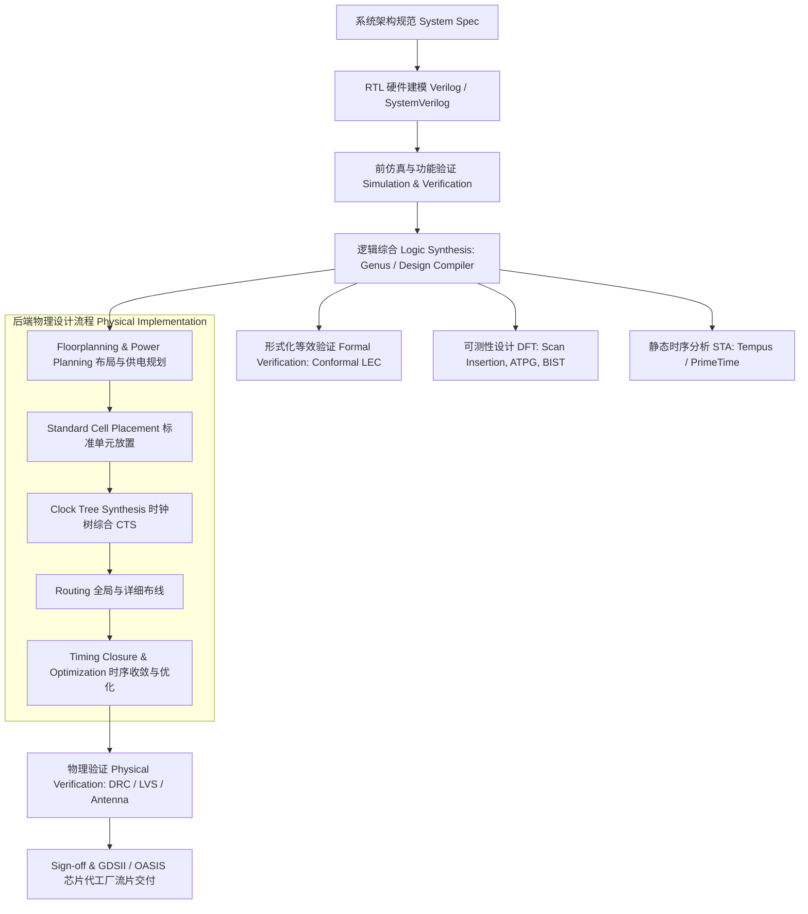

# Engineering Bookshelf (现代软件与集成电路工程经典文库)

本仓库归档并系统性整理了现代软件架构、嵌入式系统、持续交付、大规模生产运维（SRE）以及超大规模集成电路（VLSI）设计领域的权威著作与配套工程实战资源。

---

## 📚 目录导航

1. [嵌入式系统架构：Making Embedded Systems（第 2 版，2024）](#1-making-embedded-systems-第-2-版-2024)
2. [敏捷交付与自动化：Continuous Delivery（持续交付）](#2-continuous-delivery-持续交付)
3. [大规模高可靠运维：Site Reliability Engineering（Google SRE 解密）](#3-site-reliability-engineering-google-sre-解密)
4. [工程文化与规模化研发：Software Engineering at Google（在线/离线全书）](#4-software-engineering-at-google-谷歌软件工程)
5. [集成电路设计专项推荐：Introduction to VLSI Design Flow（从 RTL 到 GDSII）](#5-专项介绍introduction-to-vlsi-design-flow-剑桥2023新书)

---

## 1. Making Embedded Systems (第 2 版, 2024)

- **作者**：Elecia White
- **出版社**：O'Reilly Media（2024 年 3 月全新第 2 版）
- **归档文件**：[`embedded/Making-Embedded-Systems-2nd-Edition.pdf`](embedded/Making-Embedded-Systems-2nd-Edition.pdf)
- **规格**：428 页高清完整版，带完整层级目录与 A-Z 索引。

### 核心亮点
作为嵌入式软件设计领域的经典标杆，第 2 版全面更新了现代低功耗微控制器、RTOS 以及现代 C/C++ 设计模式：
- **硬件与软件边界划分**：如何阅读芯片数据手册、架构分层与驱动解耦。
- **状态机与任务调度**：时间片轮转、协作式调度、抢占式 RTOS 与状态模式实现。
- **外设与硬件中断**：中断服务程序（ISR）的最佳实践、DMA 高效传输与防重入设计。
- **工程稳健性与低功耗**：Watchdog 设计、低功耗休眠唤醒模式、内存限制优化与单元测试策略。

---

## 2. Continuous Delivery (持续交付)

- **作者**：Jez Humble & David Farley（Martin Fowler 签名系列）
- **出版社**：Addison-Wesley Professional
- **归档文件**：[`devops/Continuous-Delivery.pdf`](devops/Continuous-Delivery.pdf)
- **规格**：497 页高清完整版，包含完整章节及词条索引。

### 核心亮点
DevOps 与 CI/CD 领域的奠基之作，荣获 Jolt 卓越工程大奖：
- **构建部署流水线（Deployment Pipeline）**：从代码提交、单元测试、验收测试到准生产发布的阶段化自动化流水线。
- **版本控制与分支策略**：主干开发（Trunk-Based Development）与短生命周期特性分支的最佳实践。
- **发布策略与风险控制**：蓝绿部署（Blue-Green Deployment）、金丝雀发布（Canary Release）与功能开关（Feature Toggles）。
- **基础设施即代码（IaC）**：环境可重复构建、配置分层与跨环境一致性保障。

---

## 3. Site Reliability Engineering (Google SRE 解密)

- **作者**：Betsy Beyer, Chris Jones, Niall Richard Murphy, Jennifer Petoff
- **出版社**：O'Reilly Media
- **归档文件**：[`sre/Site-Reliability-Engineering.pdf`](sre/Site-Reliability-Engineering.pdf)
- **规格**：550 页官方原版高清矢量 PDF，包含全套生产图表与附录。

### 核心亮点
Google 首次公开其支撑全球数十亿用户级超大规模系统的架构与运维心法：
- **核心理念（SLI / SLO / SLA）**：通过“错误预算（Error Budget）”量化权衡发布敏捷度与系统稳定性。
- **消除琐事（Eliminating Toil）**：以软件工程方法解决运维难题，将自动化和系统设计置于手工操作之上。
- **分布式系统设计与故障防范**：负载均衡（Maglev/Envoy 思想）、级联故障防御、分布式死锁与缓存击穿治理。
- **工程文化与故障复盘**：不指责复盘文化（Blameless Postmortem）、在岗应急响应机制与事故演习。

---

## 4. Software Engineering at Google (谷歌软件工程)

- **作者**：Titus Winters, Tom Manshreck, Hyrum Wright
- **来源**：Google 官方开源电子书（中文全本离线文档库）
- **本地目录**：[`google-swe/`](google-swe/)
- **浏览方式**：支持使用任意浏览器直接打开 [`google-swe/index.html`](google-swe/index.html) 本地查看。

### 核心架构（25 章完整中文全集）
全书围绕 Google 总结的软件工程三大基石展开：**时间与变更（Time and Change）**、**规模与增长（Scale and Growth）**、**权衡与决策（Trade-offs and Costs）**。
- **第一部分：文化篇（Chapters 1–6）**
  - 什么是软件工程（与编程的区别）、团队协作、知识共享、工程师领导力。
- **第二部分：流程篇（Chapters 7–14）**
  - 测量工程生产力、代码规范（Style Guides）、代码审查（Code Review）、文档编写与多层级自动化测试体系（单元测试、测试替身 Test Doubles、大规模集成测试）。
- **第三部分：工具与基础设施篇（Chapters 15–25）**
  - 代码弃用管理（Deprecation）、大型单体仓库（Monorepo）与分支管理、Code Search 源码搜索工具、Bazel 风格构建系统、大规模静态分析、依赖管理（Dependency Management）、大规模重构（Large-Scale Changes）、CI/CD 与计算即服务（Compute as a Service）。

---

## 5. 专项介绍：《Introduction to VLSI Design Flow》 (剑桥2023新书)

除了上述四部软件与系统工程著作外，集成电路硬件设计领域的全新力作 **《Introduction to VLSI Design Flow》** 极具战略学习价值：

  

### 基本信息
- **书名**：*Introduction to VLSI Design Flow*
- **作者**：**Sneh Saurabh 教授**（IIIT Delhi 准教授，曾任 Cadence Design Systems 及 Synopsys 资深研发工程师，拥有十余年产业界 EDA 工具研发与先进工艺流片实战经验）
- **出版社**：**Cambridge University Press（剑桥大学出版社）**
- **出版时间**：2023 年 2 月（全新前沿版）
- **ISBN**：978-1009121996 (精装版) / 978-1009200813 (数字版)
- **DOI**：[10.1017/9781009121996](https://doi.org/10.1017/9781009121996)
- **官方获取通道**：[Cambridge Core 官方页面](https://www.cambridge.org/core/books/introduction-to-vlsi-design-flow/2A3705BD0513FF2DB5B7F1FE8061AE7D)（各大高校及科研院所用户可通过 CARSI / Shibboleth SSO 认证机构账号免费在线阅读与下载各章节官方 PDF）。

### 为什么推荐这本书？
传统教材往往侧重于晶体管物理（如器件物理、CMOS 反相器原理）或纯粹的高级语言描述（Verilog/VHDL 语法），造成了**从学术逻辑设计到工业级芯片流片之间的巨大断层**。
本书彻底打通了从 **RTL 代码到 GDSII 芯片版图交付** 的全流程工程暗语，是连接高校算法教学与 Synopsys / Cadence 工业界实战的最佳桥梁。

### 全书核心技术图谱 (RTL to GDSII Flow)

#### 关键技术模块分解：
1. **IC 制造与光刻基础**：半导体晶圆（Wafer）、光刻（Photolithography）多重曝光、极紫外（EUV）及先进制程工艺规则。
2. **硬件可综合建模**：Verilog 硬件建模设计准则、时序电路与组合逻辑推导、防锁存器（Latch）产生规范。
3. **逻辑综合与映射**：工艺库结构（Liberty `.lib` 格式）、门级网表生成、时序/面积/功耗约束驱动优化（SDC 约束文件编写）。
4. **静态时序分析（STA）核心**：建立时间（Setup Time）与保持时间（Hold Time）违例修复、时钟偏斜（Skew）与抖动（Jitter）、伪路径（False Paths）与多周期路径（Multicycle Paths）约束。
5. **物理设计（Place & Route）后端核心**：
   - 布局规划（Floorplan）与 Core/Die 宽高比、I/O Pad 与电源网络网格（PG Grid）设计；
   - 时钟树综合（CTS）：降低 Clock Skew 与动态功耗，构建平衡时钟树结构；
   - 寄生参数提取（RC Extraction）与串扰（Crosstalk）延迟分析。
6. **物理验证与流片交付**：设计规则检查（DRC）、电路图与网表一致性比对（LVS）、天线效应修复、以及最终的 GDSII/OASIS 版图数据流生成。

---

### 配套公开课与工业级 EDA 实战报告

Sneh Saurabh 教授围绕该书在印度国家级开放平台（NPTEL / Swayam）和 IIIT Delhi 开设了广受好评的公开课与上机实验体系《**VLSI Design Flow: RTL to GDS**》：
- **配套全套工业级 Cadence EDA 实验报告**：
  - **Part 1 实验报告（79 页）**：详细涵盖 Cadence SimVision 逻辑仿真、Cadence Genus 逻辑综合、Conformal 形式化验证、Tempus 静态时序分析以及 Modus DFT 扫描链插入。
  - **Part 2 实验报告（78 页）**：完整记录了 Cadence Innovus 平台的物理实现操作步骤（从设计导入、Floorplan、Placement、CTS 到 Detailed Routing 和 Timing Signoff）。
- **配套超清讲义幻灯片**：包含 Lecture 02（RTL to GDS 总览）、Lecture 03（制造与光刻工艺）、Lecture 10（硬件建模与综合）等核心讲义。

---

## ⚖️ 版权与使用声明
- 本仓库所收录之书籍文献仅供个人学习、科研交流与学术研讨使用。
- 商业出版物（O'Reilly Media、Addison-Wesley、Cambridge University Press）版权归原作者及出版机构所有。
- 如需商业用途或系统化部署，请支持并购买正版纸质/电子书籍。
